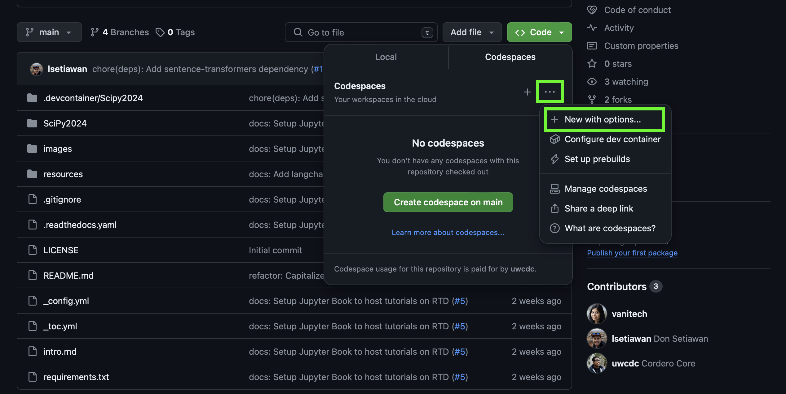
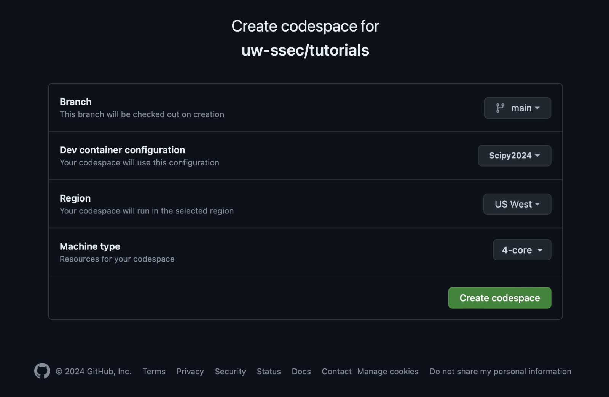

# Rubin Telescope Chatbot Panel

## Quick Start

To quickly launch a GitHub Codespace with Rubin data preloaded, 
<a title="Create New Rubin Codespace" href="https://github.com/codespaces/new?hide_repo_select=true&ref=main&repo=866827957&skip_quickstart=true&machine=standardLinux32gb&devcontainer_path=.devcontainer%2FScipy2024%2Fdevcontainer.json&geo=UsWest" target="_blank">click here</a>.

## About

This repository hosts the Chatbot Panel app designed to answer questions related to the Rubin Telescope.

## Instructions

1. **Launch GitHub Codespace**  
   Start the environment by <a title="Create New Rubin Codespace" href="https://github.com/codespaces/new?hide_repo_select=true&ref=main&repo=866827957&skip_quickstart=true&machine=standardLinux32gb&devcontainer_path=.devcontainer%2FScipy2024%2Fdevcontainer.json&geo=UsWest" target="_blank">clicking here</a>.  
   Alternatively, you can manually launch a codespace by following these steps:
   
   <div style="display: flex; gap: 10px;">
       
       
   </div>

2. **Select Notebook Environment**  
   Ensure you are on the "notebook" environment, which is activated by default on terminal.

3. **Run the Panel Application**  
   Start the chatbot panel app by running the following command:
   ```bash
   python rubin-chat/rubin-panel-app.py

## GitHub Codespaces

This repository is available to run within
[Github Codespaces](https://github.com/features/codespaces) - "a development
environment that's hosted in the cloud".

A codespace is a development environment that's hosted in the cloud. GitHub
currently gives every user
[120 vCPU hours per month for free](https://docs.github.com/en/billing/managing-billing-for-github-codespaces/about-billing-for-github-codespaces#monthly-included-storage-and-core-hours-for-personal-accounts),
beyond that you must pay. **So be sure to explicitly stop or shut down your
codespace when you are done by going to this page
([https://github.com/codespaces](https://github.com/codespaces)).**


## Contributing

If you would like to contribute to this repository, please feel free to open up
issues or pull requests, regarding current or future materials.


## Acknowledgements

We would like to thank
[Professor Andy Connolly](https://escience.washington.edu/member/andy-connolly/)
for providing the datasets and the domain expertise for building this tool

We also thank the [Allen Institute for AI (AI2)](https://allenai.org/) for
providing the Open Language Model (OLMo)

This repository is based on a [tutorial](https://github.com/uw-ssec/tutorials/tree/main) from  engineers at the
[University of Washington's Scientific Software Engineering Center (SSEC)](https://escience.washington.edu/software-engineering/ssec/)
supported by Schmidt Sciences, LLC. as part of the
[Virtual Institutes for Scientific Software (VISS)](https://www.schmidtsciences.org/viss/).

<div>
  <a href="https://escience.washington.edu/software-engineering/ssec/">
    
  </a>
  <a href="https://www.schmidtsciences.org/viss/">
    
  </a>
  <a href="https://escience.washington.edu/">
    
  </a>
  <a href="https://washington.edu/">
    
  </a>
</div>
